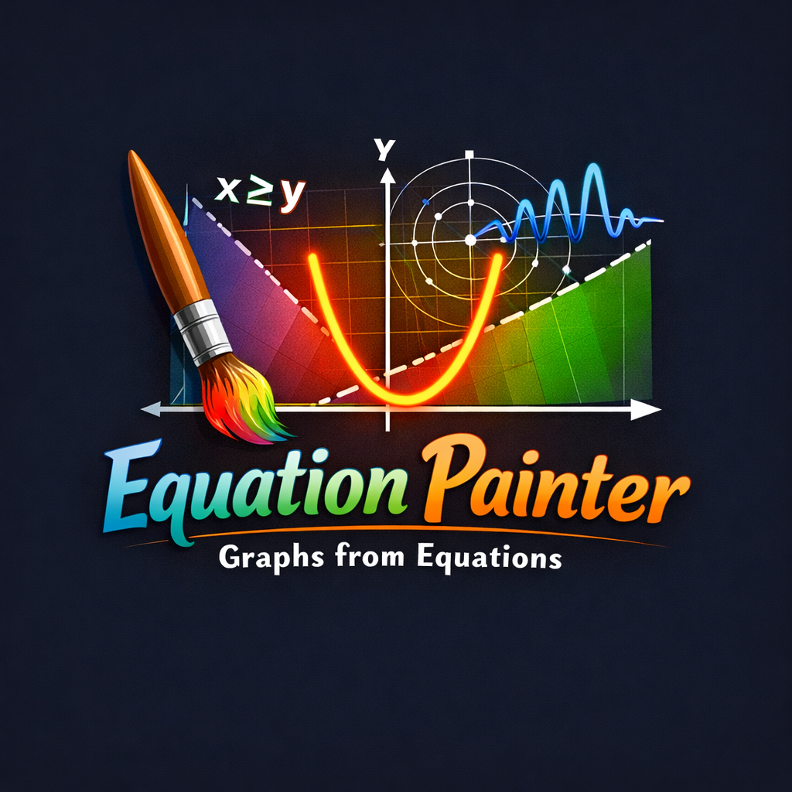

<div align="center">
  <a href="https://github.com/junayedahamed/equation_painter" target="_blank">
    
  </a>
</div>

# 📈 equation_painter
Open Source Flutter Package by **[junayedahamed](https://github.com/junayedahamed)**

A powerful, interactive, and performant Flutter package for visualizing multiple mathematical equations simultaneously with beautiful animations and a fully customizable coordinate system.

---

### Language Switch / ভাষা পরিবর্তন
**[English](#english) | [বাংলা](#bangla)**

---

<details open id="english">
<summary><b>🇬🇧 English Documentation (Click to Expand/Collapse)</b></summary>

<br>

<div align="center">
  
</div>

### ✨ Features
- ✅ **New: Interactive Panning & Zooming**: Drag to pan and pinch to zoom around the coordinate system!
- ✅ **New: Polar Coordinate Support**: Visualize equations in polar form `r = f(theta)`.
- ✅ **New: Inequality Visualization**: Shading for regions like `y >= x` or `x^2 + y^2 <= 25`.
- ✅ **New: Tap & Hover to Inspect**: Tap or hover on any curve to see the exact (x, y) or (r, theta) coordinates.
- ✅ **Robust Equation Parsing**: Type equations like `x^2 + y^2 - 100`, `sin(2x) - y`, `pow(x,2) * atan2(y,x)` directly. It supports implicit multiplication (`2x`), constants (`pi`, `e`), unit +/- and ~20 built-in math functions.
- ✅ **Coordinate Labels**: Show dynamic numbers along the axis to measure your functions.
- ✅ **Customizable Unit Scale**: By default, each grid square represents 100 units, but you can adjust this to your specific needs.
- ✅ **Configurable Units**: Define how many units each grid square represents.
- ✅ **Dynamic Animations**: Beautiful `radial`, `sequential`, `linearX`, or `linearY` draw mechanics.
- ✅ **High Performance**: Highly optimized utilizing `Float32List`, `drawRawPoints` and Marching Squares evaluation to preserve silky smooth 60fps framerates.

### 📸 Screenshots


<div style="display: flex; flex-wrap: wrap; gap: 20px; justify-content: start;">

  ## Multiple Curves with Custom Styles and Complex Functions

  


  ## Sin wave with radial animation
  

 ### Heart curve

  

  ### Cos wave with value inspection

  

  ### Inequality Visualization 

  
</div>

### 🚀 Getting Started

Add the package to your `pubspec.yaml`:

```yaml
dependencies:
  equation_painter: ^0.0.1+2
```

### 💡 Usage

```dart
EquationPainter(
  equations: [
    EquationConfig(
      function: (x, y) => x * x + y * y - 25,
      color: Colors.indigoAccent,
      strokeWidth: 4,
    ),
  ],
  unitsPerSquare: 10,
  interactive: true,
  showGrid: true,
  onPointTapped: (x, y, config) {
    print("Tapped at ($x, $y)");
  },
)
```

### 🧮 Enhanced Equation Parsing

You can parse string-based equations directly using `EquationParser`. It's highly tolerant!

#### Supported Syntax
- **Variables**: `x`, `y`
- **Constants**: `pi` ($\pi$), `e` ($e$)
- **Operators**: `+`, `-`, `*`, `/`, `^` (power)
- **Implicit Multiplication**: `2x`, `3(x+y)`, `x(y-1)`
- **Functions**:
  - **Trigonometric**: `sin`, `cos`, `tan`, `asin`, `acos`, `atan`, `atan2(y, x)`
  - **Logarithmic & Exponential**: `log`/`ln` (natural), `log2`, `log10`, `exp`
  - **Rounding & Absolute**: `abs`, `ceil`, `floor`, `round`, `sign`
  - **Miscellaneous**: `sqrt`, `cbrt` (cube root), `hypot(a, b)`, `pow(base, exp)`, `min(a, b)`, `max(a, b)`

```dart
final userEquation = "tan(20x) - tan(15y) + sin(xy) - 10";
final mathFunction = EquationParser.parseOrNull(userEquation); // Returns null if invalid 

if (mathFunction != null) {
  EquationConfig(
    function: mathFunction,
    color: Colors.pinkAccent,
  )
}
```

### ❄️ Advanced Features
- **Customizable Grid Styles**: Support for logarithmic scales, dashed lines, and custom colors.
- **Export to Image/SVG**: Easily save your visualized equations as high-quality images or SVGs.

### 🔭 Future Upgrade Ideas
- 🚀 **3D Equation Visualization**: Support for plotting $z = f(x, y)$ in a 3D coordinate system.
- 🚀 **Parametric Equation Support**: Plot curves defined by equations like $x = f(t), y = g(t)$.
- 🚀 **Live Equation Editor**: A built-in UI component to type and preview equations in real-time.
- 🚀 **Data Series Plotting**: Ability to plot discrete data points (scatter plots) alongside continuous equations.
- 🚀 **Legend & Tooltips**: Add customizable legends and more detailed information tooltips for complex graphs.

### ⭐
If you Like this project, please give it a ⭐ on GitHub and share it with your friends! It really helps me out and motivates me to keep improving it. Thank you for your support! 🙏

### 🔭 Licensing
This project is licensed under the MIT License.

<details open id="bangla">
<summary><b>🇬🇧 Bangla Documentation (Click to Expand/Collapse)</b></summary>

<br>


### বৈশিষ্ট্যসমূহ
- ✅ **নতুন: ইন্টারেক্টিভ প্যানিং ও জুমিং**: আপনি এখন গ্রাফে ড্র্যাগ করে প্যান এবং পিঞ্চ-টু-জুম করতে পারেন!
- ✅ **নতুন: পোলার কোঅর্ডিনেট সাপোর্ট**: $r = f(theta)$ ফর্মে সমীকরণ কল্পনা করার সুবিধা।
- ✅ **নতুন: ইনইকুয়ালিটি ভিজ্যুয়ালাইজেশন**: $y \ge x$ বা $x^2 + y^2 \le 25$ এর মতো অসমতা শেডিংয়ের মাধ্যমে প্রদর্শন।
- ✅ **নতুন: ট্যাপ ও হোভার ইন্সপেকশন**: কার্ভের যেকোনো স্থানে ট্যাপ বা হোভার করে তাৎক্ষণিকভাবে $(x, y)$ বা $(r, theta)$ স্থানাঙ্ক দেখা।
- ✅ **শক্তিশালী ইকুয়েশন পার্সার**: আপনি এখন সরাসরি `x^2 + y^2 - 100`, `sin(2x) - y` এর মতো সমীকরণ টাইপ করতে পারেন। এটি ಇমপ্লিসিট গুণ (`2x`), ধ্রুবক (`pi`, `e`), এবং ২০টিরও বেশি বিল্ট-ইন গাণিতিক ফাংশন সাপোর্ট করে।
- ✅ **কাস্টমাইজযোগ্য ইউনিট স্কেল**: ডিফল্টভাবে প্রতিটি গ্রিড স্কয়ার ১০০ ইউনিট প্রতিনিধিত্ব করে, তবে আপনি আপনার প্রয়োজন অনুযায়ী এটি পরিবর্তন করতে পারবেন।
- ✅ **স্থানাঙ্ক লেবেল**: ফাংশন পরিমাপ করার জন্য ডাইনামিক অক্ষেপে সংখ্যা প্রদর্শন।
- ✅ **কাস্টমাইজযোগ্য গ্রিড**: প্রতিটি গ্রিড স্কয়ার কতটুকু ইউনিটের প্রতিনিধিত্ব করবে তা আপনি নিজেই ঠিক করতে পারবেন।
- ✅ **ডায়নামিক অ্যানিমেশন**: `radial`, `sequential`, `linearX`, অথবা `linearY` স্টাইল ব্যবহার করে কার্ভ আঁকার প্রক্রিয়া অ্যানিমেট করা।
- ✅ **উচ্চ পারফরম্যান্স**: মসৃণ ৬০ FPS ফ্রেম রেটের জন্য `Float32List`, `drawRawPoints` এবং `Marching Squares` অ্যালগরিদম ব্যবহার করে অপ্টিমাইজ করা হয়েছে।

### 🚀 শুরু করা যাক

আপনার `pubspec.yaml`-এ প্যাকেজটি যোগ করুন:

```yaml
dependencies:
  equation_painter: ^0.0.1+2
```

### 💡 ব্যবহার পদ্ধতি

```dart
import 'package:equation_painter/equation_painter.dart';

// ... আপনার উইজেট ট্রির ভেতরে
EquationPainterWidget(
  width: double.infinity,
  height: 400,
  interactive: true, // ইন্টারেক্টিভ প্যানিং চালু
  unitsPerSquare: 50.0,
  alignment: Alignment.center,
  equations: [
    EquationConfig(
      function: EquationParser.parse('x^2 + y^2 - 2500'),
      color: Colors.cyanAccent,
      strokeWidth: 3,
      animationType: AnimationType.radial,
    ),
  ],
)
```

### 🧮 উন্নত সমীকরণ পার্সার

আপনি সরাসরি `EquationParser` ব্যবহার করে স্ট্রিং-ভিত্তিক সমীকরণ পার্স করতে পারেন। এটি অত্যন্ত নমনীয়!

#### সমর্থিত সিনট্যাক্স
- **ভেরিয়েবল/চলক**: `x`, `y`
- **ধ্রুবক**: `pi` ($\pi$), `e` ($e$)
- **অপারেটর**: `+`, `-`, `*`, `/`, `^` (power)
- **উহ্য গুণ (Implicit Multiplication)**: `2x`, `3(x+y)`, `x(y-1)`
- **ফাংশনসমূহ**:
  - **ত্রিকোণমিতিক**: `sin`, `cos`, `tan`, `asin`, `acos`, `atan`, `atan2(y, x)`
  - **লগারিদমিক এবং এক্সপোনেনশিয়াল**: `log`/`ln` (natural), `log2`, `log10`, `exp`
  - **রাউন্ডিং এবং এবসলিউট**: `abs`, `ceil`, `floor`, `round`, `sign`
  - **বিবিধ**: `sqrt`, `cbrt` (cube root), `hypot(a, b)`, `pow(base, exp)`, `min(a, b)`, `max(a, b)`

### 🔭 ভবিষ্যতের আপগ্রেড আইডিয়া
- 🚀 **থ্রি-ডি (3D) ইকুয়েশন ভিউয়ালাইজেশন**: $z = f(x, y)$ এর মতো ত্রিমাত্রিক সমীকরণ গ্রাফে রূপান্তর।
- 🚀 **প্যারামেট্রিক ইকুয়েশন সাপোর্ট**: $x = f(t), y = g(t)$ টাইপের কার্ভ বা বক্ররেখা আঁকার সুবিধা।
- 🚀 **লাইভ ইকুয়েশন এডিটর**: সরাসরি ইউজার ইন্টারফেসে টাইপ করার সাথে সাথে গ্রাফ প্রিভিউ করার সুবিধা।
- 🚀 **ডেটা সিরিজ প্লটিং**: নিরবচ্ছিন্ন সমীকরণের পাশাপাশি ডিসক্রিট ডেটা পয়েন্ট বা স্ক্যাটার প্লট করার ক্ষমতা।
- 🚀 **লেজেন্ড এবং টুলটিপস**: জটিল গ্রাফের জন্য কাস্টম লেজেন্ড এবং বিস্তারিত তথ্যের টুলটিপ যোগ করা।

### ⭐

আপনি যদি এই প্রকল্পটি পছন্দ করেন, তাহলে দয়া করে GitHub-এ একটি ⭐ দিন এবং আপনার বন্ধুদের সাথে শেয়ার করুন! এটি আমাকে সত্যিই সাহায্য করে এবং আমাকে উন্নত করতে উৎসাহিত করে। আপনার সমর্থনের জন্য ধন্যবাদ! 🙏


</details>

## 📄 License
This project is licensed under the MIT License - see the [LICENSE](LICENSE) file for details.

## 🤝 Contributing
Contributions are welcome! Feel free to open issues or submit pull requests.

---
**Crafted with ❤️ for Mathematicians and Developers.**
